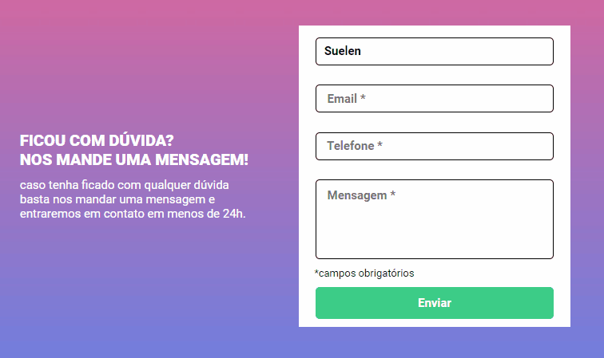

<h1>🚀 Quest - Formulário com validação. 🚀</h1> 
<h2>Objetivo da Quest:</h2>

Criar um formulário com HTML e CSS. E com JavaScript, fazer com que os campos que estiverem vazios, as bordas ficarem vermelhas
e aparecer um aviso de "campo obrigatório" na cor vermelha. Caso os campos estiveram devidamente preenchidos, as bordas devem ficar na cor verde. 

## Curso:
- DevQuest
 

# Gif Project

 

## Técnologias Utilizadas:

- HTML 5
- CSS
- JavaScript (Intermediário)
 

### Redes:

- Linkedin - [Suelen Cardoso](www.linkedin.com/in/suelen-s-cardoso/)
- GitHub - [Suelen Cardoso](https://github.com/SuelenSCardoso/)
