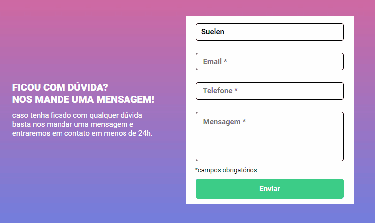

<h1>🚀 Quest - Formulário com validação. 🚀</h1> 
<h2>Objetivo da Quest:</h2>

Criar um formulário com Html e Css. E com JavaScript, fazer com que os campos que estiverem vazios, as bordas ficarem vermelhas
e aparecer um aviso de "campo obrigatório" na cor vermelha. Caso os campos estiveram devidamente preenchidos, as bordas devem ficar na cor verde. 

# Gif Project

 

### Deployment

[Formulário](https://suelenscardoso.github.io/validando-formulario/)

## Técnologias Utilizadas:

  
 
 
 

### Redes:

- Linkedin - [Suelen Cardoso](www.linkedin.com/in/suelen-s-cardoso/)
- GitHub - [Suelen Cardoso](https://github.com/SuelenSCardoso/)
